# LoadFAST FAQ's

## Subscription Plans

**What subscription plans are available for LoadFAST?**

- **Free Plan:** Perform load tests for up to 50 users ($0 + Azure infrastructure cost).
  - With the Free Plan, platform fees are not charged; however, Azure infrastructure costs are borne by the user.
- **Pro Plan:** No limit on the number of users ($1500/month + Azure infrastructure cost)

*Note: Free support is available for both plans. Azure infrastructure costs are mandatory for all users.*

**Where can I purchase LoadFAST?**

You can purchase LoadFAST from the [Microsoft Azure Marketplace](https://azuremarketplace.microsoft.com/en-us/marketplace/apps/maqsoftware.powerbiloadanalyzer?tab=Overview).

**Can I change my plan after purchase?**

Yes, you can upgrade or downgrade your plan at any time through the Azure portal.

**How do I upgrade to the Pro plan?**

To upgrade to the Pro plan, follow these steps:

- Navigate to the [Microsoft Azure Marketplace](https://azuremarketplace.microsoft.com/en-us/marketplace/apps/maqsoftware.powerbiloadanalyzer?tab=Overview).
- Start the redeployment process for LoadFAST.
- When prompted, select the **Pro** option in the Software Plan dropdown.
- Complete the remaining steps as you did during your initial deployment.
- For detailed instructions, refer to the official [LoadFAST: Technical Documentation](https://maqsoftware.gitbook.io/loadfast-technical-documentation/setting-up/deploy/deploy-automatically-via-azure-marketplace).

*Note: Upgrading does not affect your existing data or configuration. The process only changes your subscription plan.*

## Set Up Details

**How do I set up and configure LoadFAST?**
- Step-by-step setup instructions are available in the documentation: [LoadFAST: Technical Documentation](https://maqsoftware.gitbook.io/loadfast-technical-documentation).
- For a quick overview, watch the [Demo video](https://links.maqsoftware.com/LoadFAST-demo).

## Key Features & Capabilities

**What are the key features and advantages of LoadFAST?**
- Create collections to group multiple reports, add collaborators, apply user actions, and perform test runs.
- Run load tests with customizable load counts at the report level.
- Analyze detailed performance metrics for collections, reports, pages, and visuals with Insight Report.
- Evaluate the impact of reports on Fabric capacity utilization.
- Optimize Fabric capacity for maximum efficiency.
- Analyze report performance, including user load and interactions.
- Identify reports and visuals with high load times.
- Manage Fabric capacity utilization to ensure the ideal setup across multiple reports and avoid under- or over-provisioning.

## GIT Integration Feature

**How does LoadFAST automate load testing with GIT integration?**

With GIT integration, LoadFAST automates creating collections, defining tests, and triggering runs all within a single pipeline workflow. This streamlines testing and removes manual steps, making performance validation faster and more reliable.

## Potential Failure Scenarios

**What are some possible reasons for failure when using LoadFAST?**

**Failed to retrieve existing collections**  
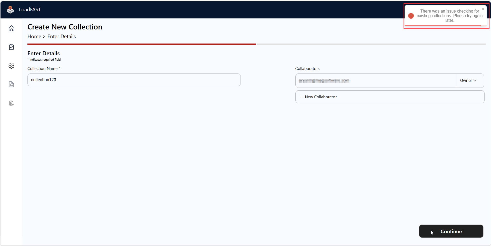

*Recommended Actions:*
- Refresh the page to reload the collections.
- If the issue persists, verify that the post-deployment PowerShell script has executed successfully.

**Load count exceeds cluster limit**
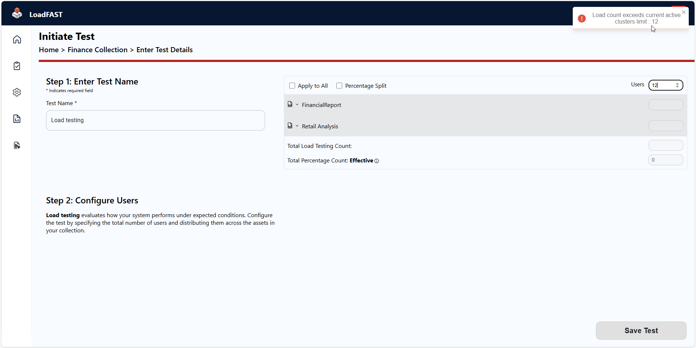

*Recommended Actions:*
- If the current cluster load count is less than the maximum load count limit, navigate to Admin Settings and increase the load count as needed.

  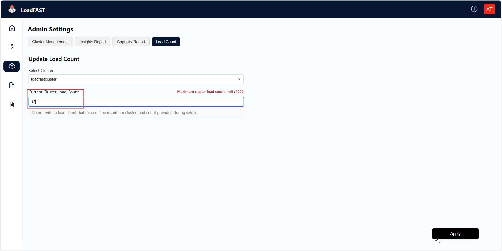
  
- If the current cluster load count is equal to or greater than the maximum limit, reduce the load count in your test run.

**Report embedding failed while adding user action**
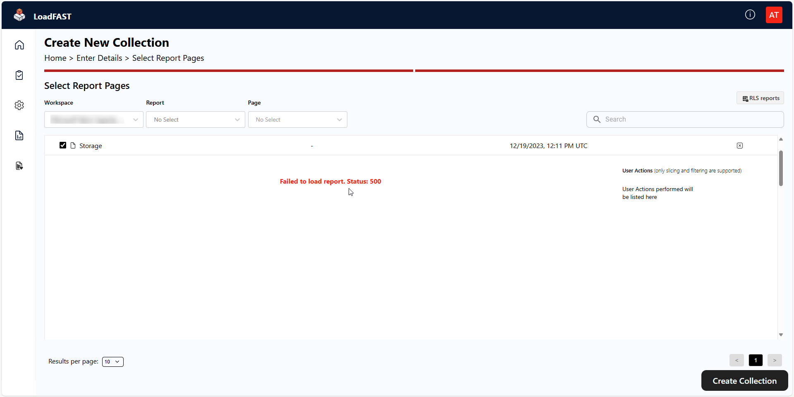

*Recommended Actions:*  
- Confirm that embedding is enabled in the [Power BI Admin Portal](https://app.powerbi.com/admin-portal).  
- Ensure that tenant settings are configured correctly. For detailed instructions, refer to the [LoadFAST: Technical Documentation](https://maqsoftware.gitbook.io/loadfast-technical-documentation/setting-up/prepare/pre-deployment/set-up-and-configure-the-power-bi-tenant-settings#configure-the-tenant-settings).

**Unable to trigger the test**  
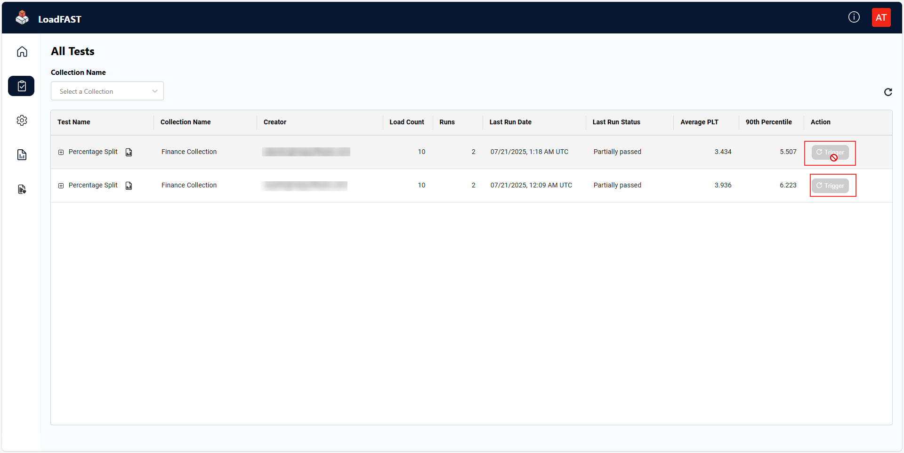

*Recommended Actions:*  

- This can occur if the clusters are turned off. To resolve this, follow these steps:
   
     - Navigate to the **Admin Settings** page.  
  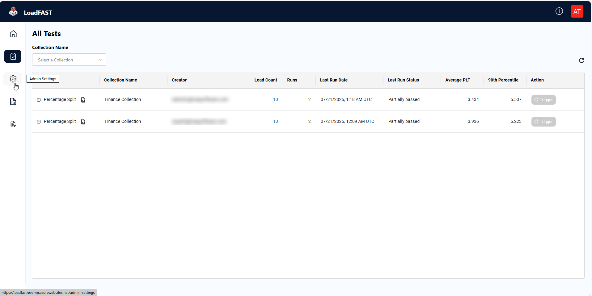
   
     - Under **Management Type**, ensure **Manual** is selected.  
  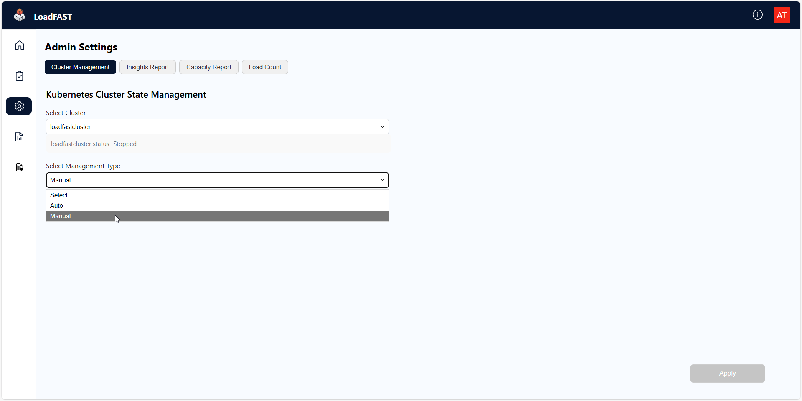
   
     - Toggle the cluster status switch to **ON**.  
  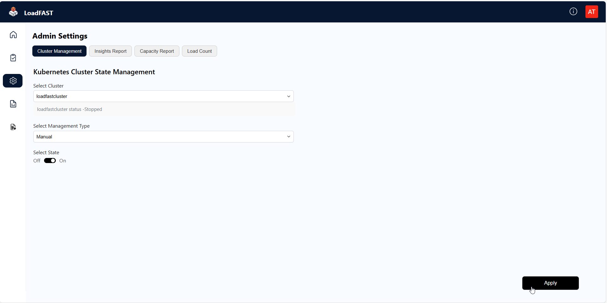
   
     - Click **Apply** to activate the cluster.

**Insight Report fetch failed**  
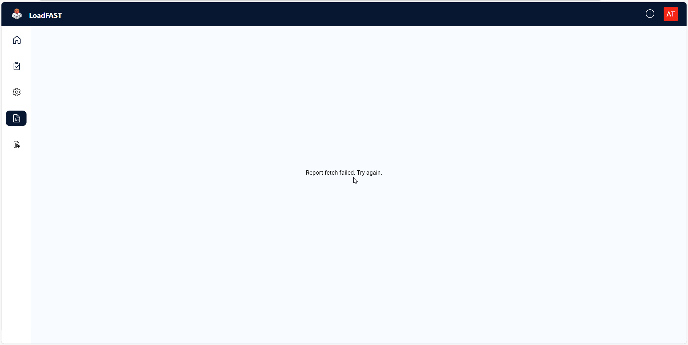

*Recommended Actions:*  
- Review your configuration details in Admin Settings and update them if necessary.  
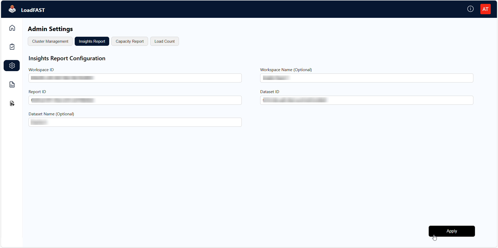

- Click **Apply** to save the changes.

**Insight Report not loading**  

*Recommended Actions:*  
- Verify that the report is configured correctly in [Power BI Services](https://app.powerbi.com/home).

**Capacity Report fetch failed**  
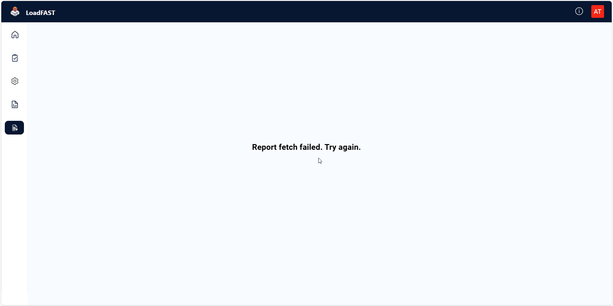

*Recommended Actions:*  

- Review your configuration details in Admin Settings and update them if necessary.  
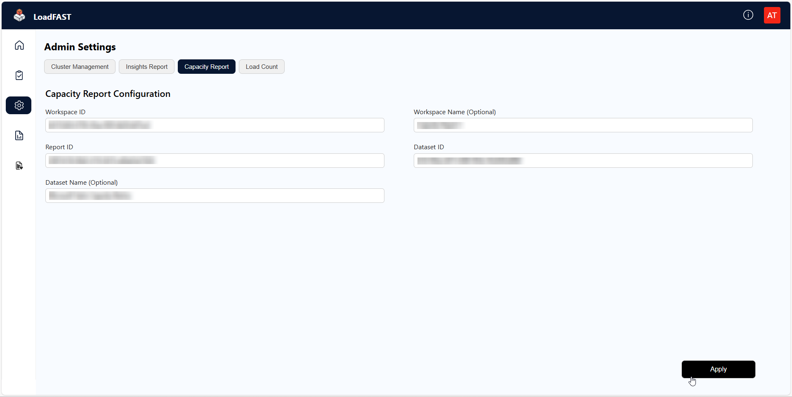

- Click **Apply** to save the changes.

**LoadFAST Web App not loading**  

*Recommended Actions:*  
- Confirm that the application is configured correctly. For guidance, refer to the [LoadFAST: Technical Documentation](https://maqsoftware.gitbook.io/loadfast-technical-documentation/setting-up/configure/add-the-redirect-uris#navigate-to-the-redirect-uris-section-1).

**Admin Settings icon not visible**  

*Recommended Actions:*  
- Ensure that the App Role is created. For instructions, see the [LoadFAST: Technical Documentation](https://maqsoftware.gitbook.io/loadfast-technical-documentation/setting-up/prepare/pre-deployment/create-an-app-registration-for-the-loadfast-api#create-an-app-role).  
- Assign the Admin Role as described [here](https://maqsoftware.gitbook.io/loadfast-technical-documentation/setting-up/configure/assign-admin-roles-in-the-application).

## Troubleshooting & Frequently Encountered Issues

### Common Issues and Solutions

**Why is the page not loading?**

- This may be due to incorrect authentication configuration. Please verify your authentication settings.

**What should I do if I see 'Something Went Wrong'?**

If you encounter this message, please contact our support team at [loadfast@maqsoftware.com](mailto:loadfast@maqsoftware.com).

### Create Collection

**Can we select a specific page while selecting a report?**
  - **Yes**, while selecting a report, the dropdown arrow next to the report name will open all the pages. You can untick the pages you don't need.  

**How do I apply a User Action?**
  - After selecting the report, click the dropdown next to the report name. Then you will see the **+** icon in the user action column; you can add a user action from there.

**Why is the User Action button disabled in an RLS-enabled report, and how can I apply a User Action?**  
  - If you've selected an **RLS-enabled report**, the **User Action** button will be disabled until you **configure RLS** details. Once RLS details are configured, you can click the dropdown arrow next to the report name to see the **+** icon and add a User Action.

**What should I enter in Role Name and Role Email while configuring RLS?**
  - In **Role Name**, select the specified role. In **Role Email ID**, if you have admin permissions, enter the email of the user on whose behalf you want to view the report; otherwise, your own email will be auto-filled.

**What access levels can be assigned to collaborators?**
  - You can assign **Editor** or **Viewer** level access to the collaborator.

### Edit Collection

**Can I delete a collection?**
  - **No**, there is currently no option available in the application to delete a collection.If deletion is required, it can be performed by executing a SQL query directly on the backend database. For assistance with this process, please contact support team.

**Can I edit a collection?**  
- **Yes**, you can update the report and modify collaborators **until a test run is created**. For more details, refer to the [LoadFAST Technical Documentation](https://maqsoftware.gitbook.io/loadfast-technical-documentation/resources/how_to_use#create-collection).

**Can I change collaborators after creating a collection?**
  - **Yes**, you can add or remove any collaborator until the test run is created. After creating a test run, collaborator changes are not allowed.

**Can I change the report after creating a collection?**
  - **Yes**, if you have not created a test run, you can change the report.

### Main Page

**How can I find an old collection?**
  - Using the **Search Bar** and **Filters**, you can easily find the collection.

**How can I see only the collections I created?** 
  - In **My Collection**, you will see the collections you created.

**Can I see collections in both simple and detailed view?**
  - **Yes**, using **Table View** and **Tile View**, you will be able to see both the detailed and simple views of collections.

**How do I sign out?**
  - In the **Header** at the top-right corner, you will find the User Settings icon. Click on it to see the **Sign Out** button.

### Create Test

**Why can't I switch 'Apply to all' / 'Percentage split' even after entering the user count?**
  - **Deselect** the current option before choosing another one.

**When should I use 'Apply to all' and when should I use 'Percentage split'?**
  - Use **Apply to all** when you want to assign the specified load count to each page.
  - Use **Percentage split** when you want to divide the user count across the report based on specified percentages.

**What does 'Total Load Testing Count' mean?**
  - It means the **total number of  concurrent users** you want to simulate in the test run.

**What does 'Total Percentage Count: Effective' mean?**
  - It represents the **calculated distribution** of user load across clusters, based on the **percentage values** you’ve entered for each. It should be *100* to create a test run.

**I clicked the Trigger button, but nothing happened. Why?**
  - If you see a **triggered successful** toast, it will *display the result after some time*. Just refresh the page using ; otherwise, check the cluster from admin settings.

**Why is the Trigger button disabled?**
  - Either you have only **Viewer** access or the **Clusters** are off; start the cluster from admin settings.

**What does 'Partially Passed' mean?**
  - It means *few pages* of the report **failed**.

### Admin Settings

**How can I check the status of a cluster?**
- Navigate to **Admin Settings**, in cluster management the status of each cluster is displayed below the selected cluster.

**How can I start or stop a cluster?**
  - Go to **Admin Settings > Cluster Management**, select management type **Manual**, and toggle the **ON/OFF** button.

**Why isn't the cluster starting after selecting  management type 'Auto' in cluster management?**
  - In **Auto**, the cluster only gets **stopped** after the specified hours. To start the cluster, you have to select the management type **Manual**, and toggle the **ON/OFF** button for step-by-step guide refer [LoadFAST: Technical Documentation](https://maqsoftware.gitbook.io/loadfast-technical-documentation/resources/how_to_use#admin-settings).

**Can anyone start/stop the same cluster?**
  - **No**, only the admin can start/stop the cluster.

### Insight Report

**Why is nothing visible in my Insight Report?**

Please ensure you have selected the relevant collection. If the issue persists, review your configuration in Admin Settings. If the problem continues, verify the report configuration in [Power BI Services](https://app.powerbi.com/home).

## High Level Checklist

**Checklist for Users: Validate Before Using LoadFAST**

Before getting started with LoadFAST, ensure the following steps are completed:

- [ ] **Select** and **Deploy** LoadFAST from the [Azure Marketplace](https://azuremarketplace.microsoft.com/en-us/marketplace/apps/maqsoftware.powerbiloadanalyzer?tab=Overview)
- [ ] Review the setup [LoadFAST: Technical Documentation](https://maqsoftware.gitbook.io/loadfast-technical-documentation) available in both the Azure Marketplace and the tool.
- [ ] **Verify all prerequisites** are met, including necessary Azure resources and Power BI permissions.
- [ ] Read the [How to Use LoadFAST](https://maqsoftware.gitbook.io/loadfast-technical-documentation/resources/how_to_use) guide to understand the tool's features and workflow.
- [ ] Check the [FAQ section](https://maqsoftware.gitbook.io/loadfast-technical-documentation/resources/faqs) for quick answers to common questions or issues.

✅ Once all steps are complete, you're ready to start using LoadFAST!

---
